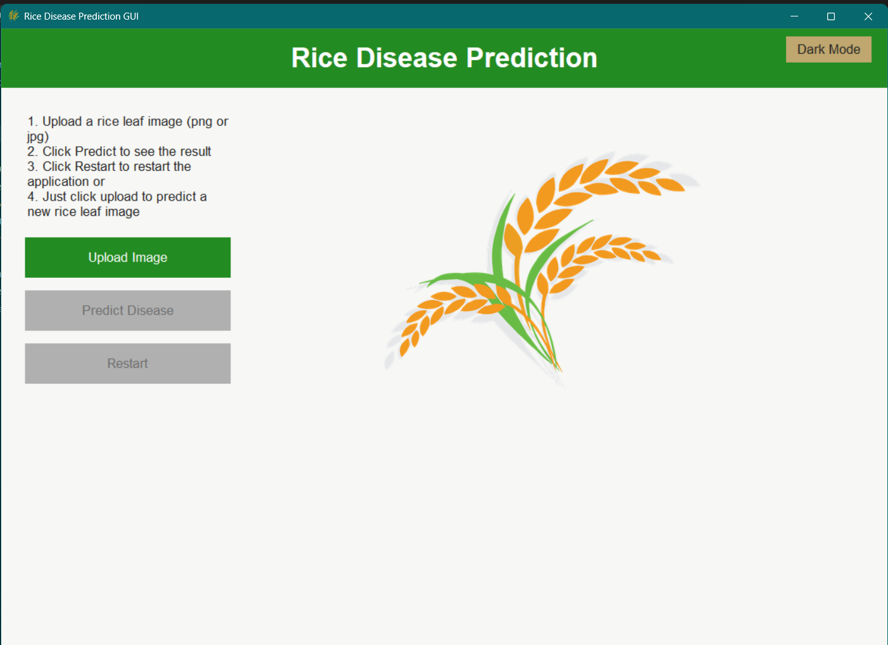
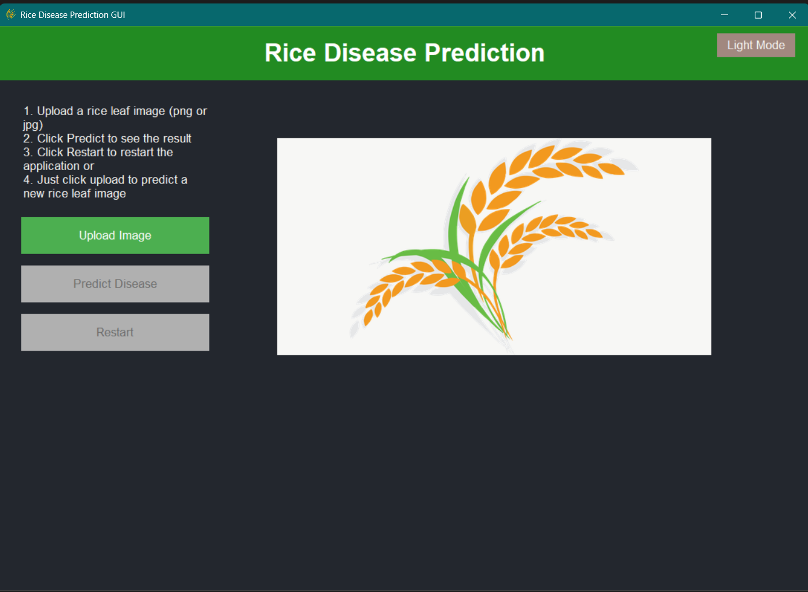
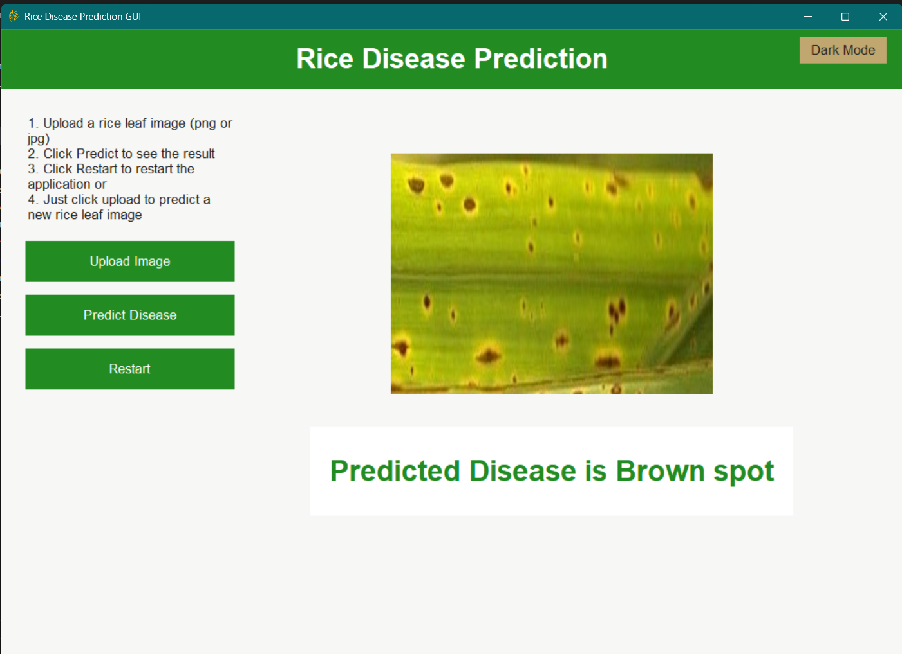
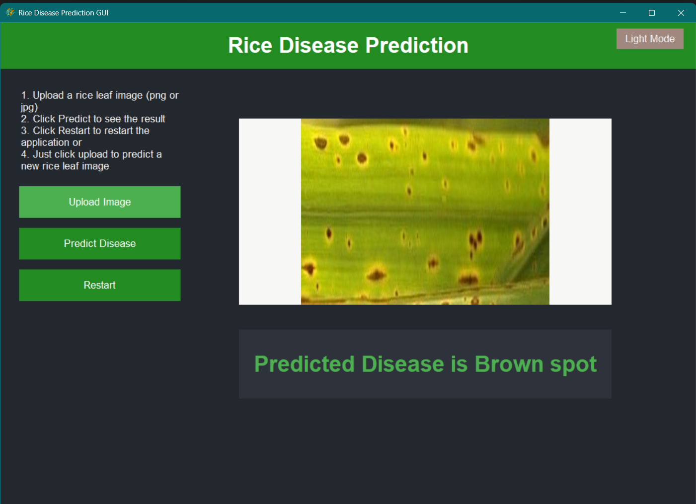

# Rice Disease Prediction GUI

A modern, user-friendly desktop application for predicting rice leaf diseases from images using a trained machine learning model.

## Features
- **Image Upload:** Easily upload rice leaf images (PNG or JPG) for analysis.
- **Disease Prediction:** Instantly predicts one of three common rice diseases using a pre-trained model.
- **Responsive Modern GUI:**
  - Clean, two-column layout with dynamic resizing and responsive elements.
  - Dark mode toggle and modern sans-serif font for improved readability.
  - Button hover effects and clear visual feedback.
- **Prediction Feedback:** Results are displayed in a styled, resizable info box.
- **Error Handling:** User-friendly pop-up dialogs for errors and issues.
- **Restart Functionality:** Restart the application at any time for a fresh session.

## Supported Rice Diseases
- Bacterial leaf blight
- Brown spot
- Leaf smut

## Getting Started

### Prerequisites
- Python 3.9 or 3.10
- Recommended: Use a virtual environment (e.g., `venv` or `conda`).


### Usage
1. Run the GUI:
   ```bash
   python rice_disease_pred_GUI.py
   ```
2. In the application:
   - Upload a rice leaf image (PNG or JPG).
   - Click **Predict Disease** to see the result.
   - Click **Restart** to restart the application, or simply upload another image to predict again.

### Folder Structure
```
rice-parakeet-main/
├── model/
│   └── rice_pred.pkl           # Trained ML model (required)
├── images/
│   └── rice.png                # Default preview image
├── rice_disease_pred_GUI.py    # Main GUI application
├── requirements.txt            # Python dependencies
└── README.md                   # Project documentation
```

## Notes
- Ensure that `model/rice_pred.pkl` exists for predictions to work.
- The GUI is responsive and will adjust to different window sizes.
- All error messages are shown as pop-up dialogs for clarity.

## Notes on Customization
- You can modify the color palette and fonts in `rice_disease_pred_GUI.py` for a different look.
- Add more disease classes by updating the model and label list.

## For Developers

If you want to contribute or run this project on your own machine, follow these steps:

### 1. Clone the Repository
```bash
git clone <repo-url>
cd rice-parakeet-main
```

### 2. Set Up a Virtual Environment (Recommended)
```bash
# For Windows
python -m venv rice_env
rice_env\Scripts\activate

# For macOS/Linux
python3 -m venv rice_env
source rice_env/bin/activate
```

### 3. Install Python Dependencies
```bash
pip install -r requirements.txt
```

### 4. Run the GUI Application
```bash
python rice_disease_pred_GUI.py
```

### 5. Edit and Retrain the Model (Jupyter Notebook)
- Open the provided Jupyter notebook (e.g., `Rice_Disease_Training.ipynb`) in the repo or create your own.
- Make sure your virtual environment is activated, then launch Jupyter:
  ```bash
  jupyter notebook
  ```
- Use the notebook to retrain or update the model as needed.
- Save the trained model as `rice_pred.pkl` in the `model/` directory.
- Restart the GUI to use the updated model.

### 6. Additional Tips
- Always keep your dependencies up-to-date by running `pip install -r requirements.txt` after pulling new changes.
- If you add new dependencies, update `requirements.txt`.
- Use version control best practices (branches, pull requests, etc.) when contributing.

---

## Jupyter Notebook Reference
- The main notebook for model training and updates is: `Rice_Disease_Training.ipynb`
- Use this notebook to preprocess data, train the classifier, evaluate performance, and export the trained model as `rice_pred.pkl` into the `model/` directory.
- Ensure your environment matches the requirements in `requirements.txt` before running the notebook.

## Model Details
- **Model Type:** Scikit-learn classifier (e.g., RandomForestClassifier or similar)
- **Input:** RGB image of a rice leaf (PNG or JPG)
- **Image Preprocessing:** Images are resized to 128x128 pixels and normalized before prediction.
- **Classes:**
  - Bacterial leaf blight
  - Brown spot
  - Leaf smut
- **Output:** Predicted disease label
- **Accuracy:**  80% on validation set
- **Updating the Model:** Retrain using the notebook and overwrite `model/rice_pred.pkl` with the new model.

## Screenshots





## Troubleshooting
- **Model not found:** Ensure `model/rice_pred.pkl` exists.
- **Tkinter error:** Make sure Python was installed with Tkinter support.
- **Image not loading:** Only PNG or JPG formats are supported.

## Contact
For questions or support, please open an issue on this repository or email [your.email@domain.com](mailto:your.email@domain.com).

## License
This project is for educational and research purposes. Made as my final year project for my computer science degree in KNUST. 

---

**Developed with ❤️ for modern, accessible plant disease diagnosis.**
