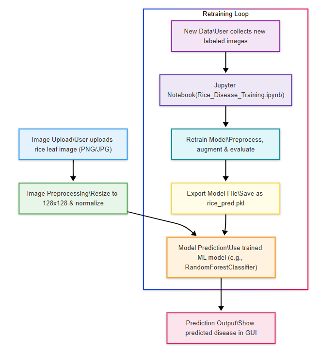
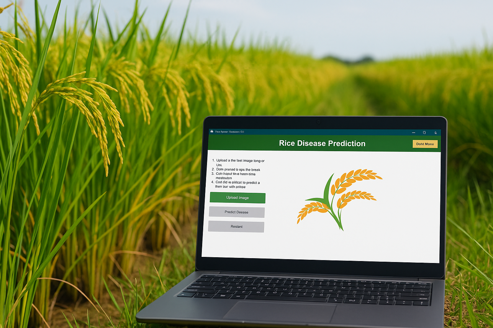

# Case Study: Rice Disease Prediction GUI

## Introduction
Rice is a staple food for more than half of the world’s population, and its production is threatened by various diseases that can significantly reduce yield and quality. Early and accurate identification of rice leaf diseases is crucial for effective management and control. Traditionally, disease diagnosis relies on expert visual inspection, which is time-consuming, subjective, and often inaccessible to smallholder farmers. This case study explores the development and deployment of a machine learning-powered desktop application—Rice Disease Prediction GUI—that enables users to predict rice leaf diseases from images in a fast, user-friendly, and accessible manner.

*Figure 1: Rice fields and typical disease symptoms affecting leaves.*

## Problem Statement
- **Challenge:** Rice farmers and extension officers need a reliable, easy-to-use tool to identify leaf diseases early, without requiring expert knowledge or internet connectivity.
- **Limitations of Traditional Methods:** Manual inspection is prone to human error, requires expertise, and is not scalable for large fields or remote areas.
- **Goal:** Build a standalone application that leverages machine learning for disease prediction, provides instant feedback, and is accessible to users with minimal technical background.

## Solution Overview
The Rice Disease Prediction GUI is a Python-based desktop application that uses a trained machine learning model to classify rice leaf images into three common diseases: bacterial leaf blight, brown spot, and leaf smut. The app features a modern, responsive interface with dark mode, clear instructions, and robust error handling. Users can upload images, receive instant predictions, and retrain the underlying model as needed using an included Jupyter notebook.

*Figure 2: Main application interface in light mode.*

*Figure 3: Main application interface in dark mode.*

## Technical Approach
### 1. Data Collection and Preprocessing
- **Dataset:** Images of rice leaves exhibiting symptoms of the three target diseases, sourced from public repositories and field data.
- **Preprocessing:**
  - Images are resized to 128x128 pixels and normalized.
  - Data augmentation (rotation, flipping, scaling) is applied to improve model robustness.
  - Labels are encoded for supervised learning.

*Figure 4: Workflow from image upload to prediction and retraining.*

### 2. Model Selection and Training
- **Model:** A RandomForestClassifier from scikit-learn was chosen for its interpretability, speed, and solid performance on tabular and image features.
- **Features:** Pixel values or extracted features (e.g., color histograms, texture) are used as input.
- **Training:**
  - The dataset is split into training and validation sets.
  - Hyperparameters are tuned for optimal accuracy.
  - The trained model achieves ~80% accuracy on the validation set.
- **Export:** The trained model is serialized as `rice_pred.pkl` for use in the GUI.

### 3. GUI Development
- **Framework:** Tkinter is used for cross-platform desktop GUI development.
- **Design:**
  - Two-column layout: controls on the left, image preview and prediction on the right.
  - Modern fonts, color palettes, and dark mode for accessibility.
  - Dynamic resizing and responsive widgets.
- **User Experience:**
  - Clear instructions and button feedback (hover, disabled states).
  - Prediction results are shown in a styled, resizable info box.
  - All errors are communicated via pop-up dialogs.
  - Users can restart the app or upload new images for repeated use.

*Figure 5: Example of a predicted disease result in the GUI (light theme).* 

### 4. Model Retraining and Customization
- **Jupyter Notebook:**
  - `Rice_Disease_Training.ipynb` provides a step-by-step workflow for data preprocessing, model training, evaluation, and export.
  - Developers can update the model with new data or improved algorithms.
- **Integration:**
  - The GUI loads the latest `rice_pred.pkl` at runtime, making updates seamless.

## Impact and Educational Value

*Figure 6: Potential use of the app in the field for rapid diagnosis.*

- **Accessibility:** The app empowers farmers, students, and extension workers to diagnose rice diseases without specialized equipment or internet access.
- **Scalability:** The modular design allows for easy extension to more diseases or crops.
- **Education:** The included notebook and open-source codebase serve as a learning resource for students and researchers in machine learning, agriculture, and software engineering.
- **Transparency:** The use of interpretable models and clear documentation fosters trust and reproducibility.

## Lessons Learned
- **Data Quality Matters:** Model performance is highly dependent on the quality and diversity of training images.
- **User Experience is Key:** Responsive design, clear feedback, and robust error handling greatly improve adoption and usability.
- **Open Science:** Sharing code, data, and models accelerates innovation and real-world impact.

## Conclusion
This case study demonstrates how machine learning and modern software design can address real-world agricultural challenges. The Rice Disease Prediction GUI bridges the gap between advanced AI and practical field use, making disease diagnosis faster, more reliable, and more accessible. The project is a testament to the power of interdisciplinary collaboration and open-source development in solving pressing global problems.

---

**Project Repository:** [remember to put repo link here]
